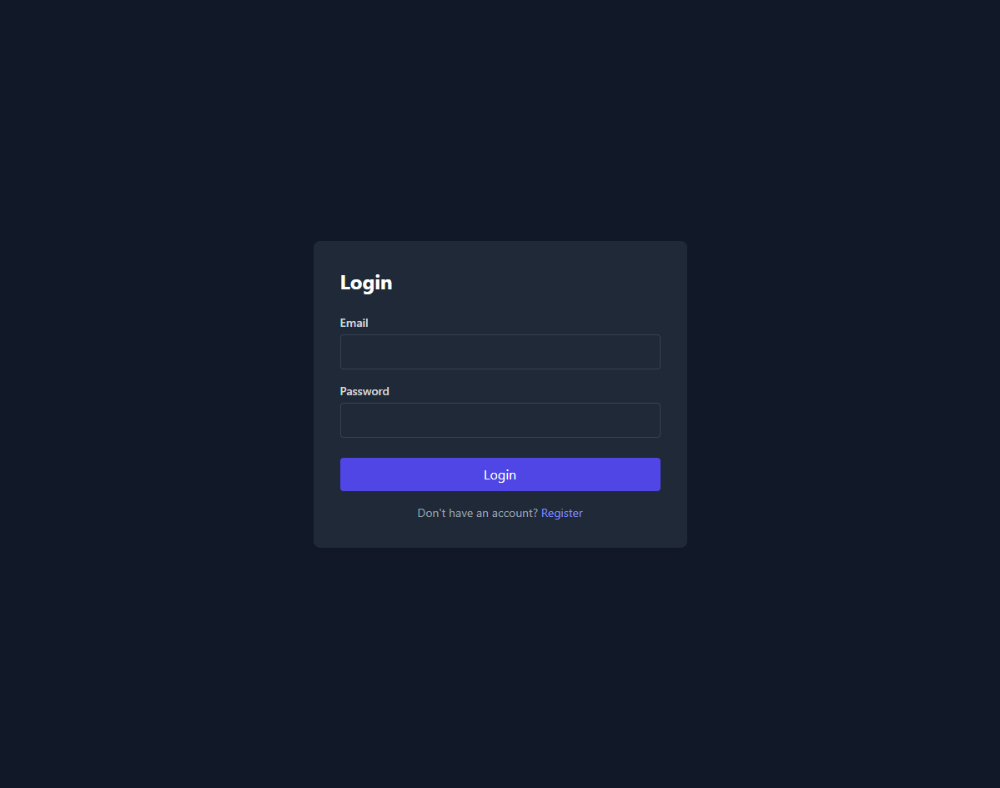
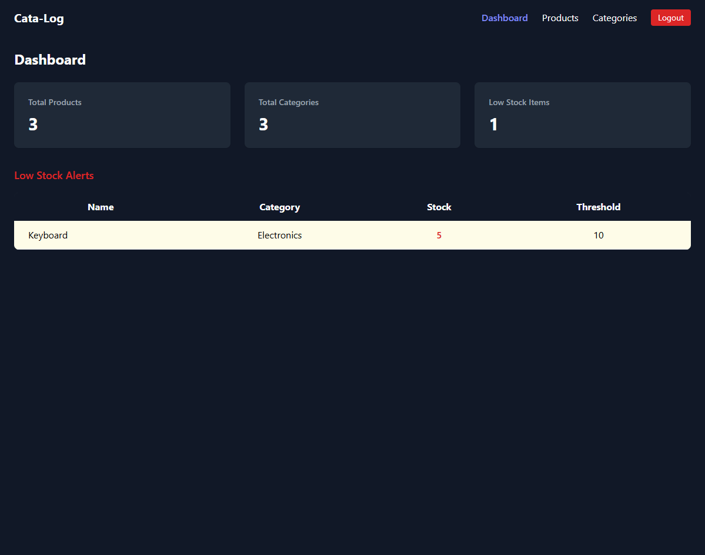
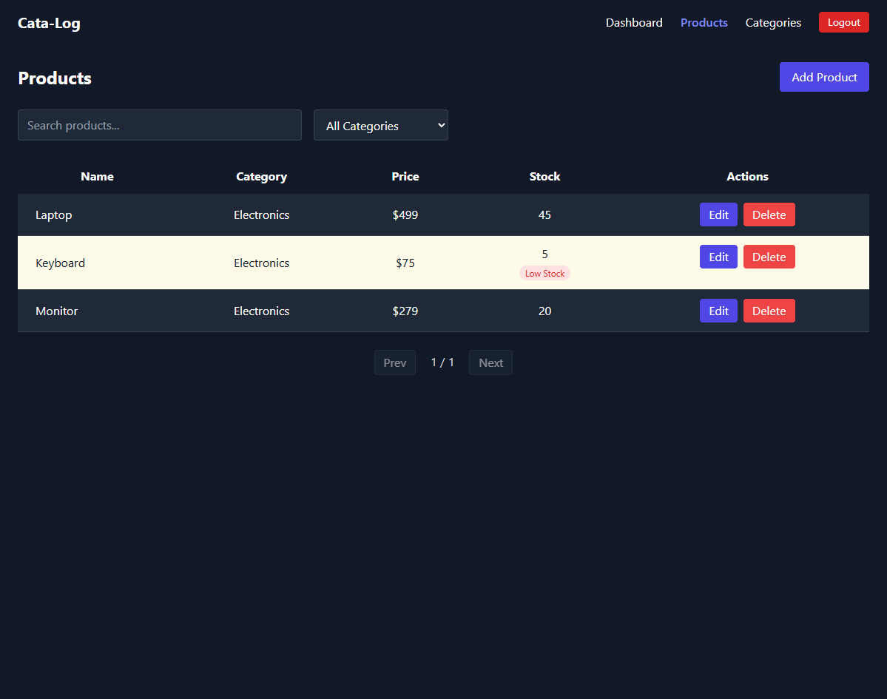
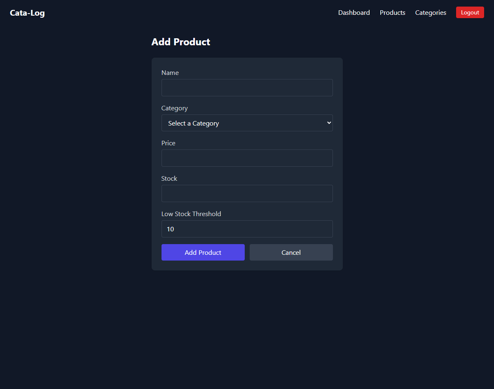
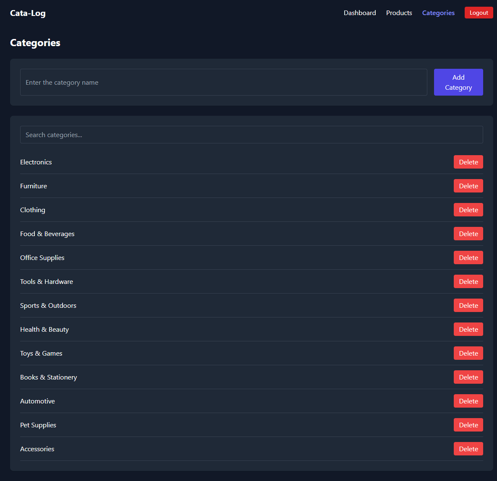
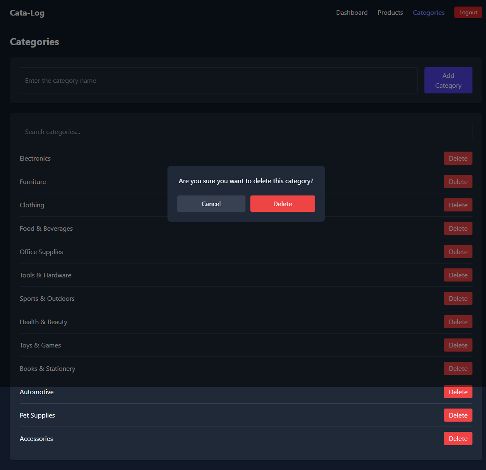
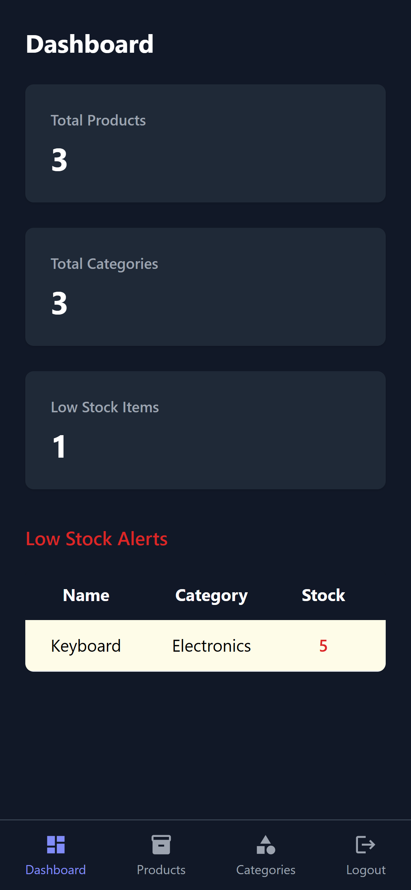
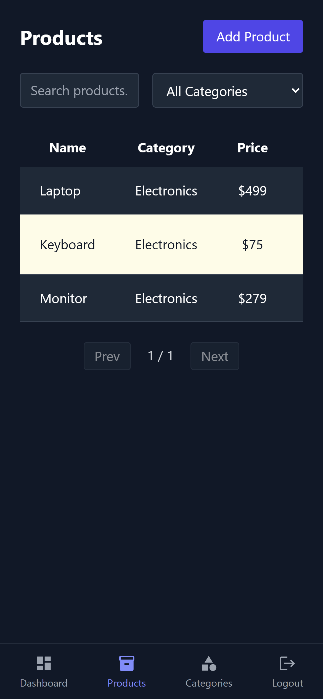

# Cata-Log v2

A full-stack inventory management system built with the MERN stack. Features role-based authentication, real-time dashboard stats, low stock alerts, search/filter/pagination, and a clean dark UI.

## Live on Vercel: https://cata-log-app-srhfalcon.vercel.app/

**Demo Account:**
| Role | Email | Password |
|------|-------|----------|
| Admin | Test123@gmail.com | Test123 |

## Tech Stack


## Features

- JWT authentication with role-based access control (admin / user)
- Dashboard with live stat cards and low stock alerts
- Full CRUD for products and categories
- Search, filter by category, and pagination
- Per-product low stock threshold
- Skeleton loading states
- Toast notifications
- Confirmation modal for deletions
- Form validation
- Responsive design with mobile bottom navbar
- Dark UI

## Screenshots

### Desktop







### Mobile



## Getting Started

### Prerequisites

- Node.js
- MongoDB Atlas account

### Installation

1. Clone the repository
```bash
git clone https://github.com/RenAmamiya0411/Cata-Log-Inventory-Management-System-Web-App.git
cd Cata-Log-Inventory-Management-System-Web-App
```

2. Install frontend dependencies
```bash
npm install
```

3. Install backend dependencies
```bash
cd backend
npm install
```

4. Set up environment variables - see [Environment Variables](#environment-variables)

5. Start the backend
```bash
cd backend
npm run dev
```

6. Start the frontend
```bash
npm start
```

## Environment Variables

Create a `.env` file in the `backend` directory with the following:
```env
MONGO_URI=your_mongodb_atlas_connection_string
JWT_SECRET=your_jwt_secret
PORT=5000
```

## API Endpoints

### Auth

| Method | Endpoint | Description | Access |
|--------|----------|-------------|--------|
| POST | /api/auth/register | Register a new user | Public |
| POST | /api/auth/login | Login user | Public |

### Products

| Method | Endpoint | Description | Access |
|--------|----------|-------------|--------|
| GET | /api/products | Get all products | Protected |
| GET | /api/products/:id | Get single product | Protected |
| POST | /api/products | Add a product | Admin |
| PUT | /api/products/:id | Update a product | Admin |
| DELETE | /api/products/:id | Delete a product | Admin |

### Categories
| Method | Endpoint | Description | Access |
|--------|----------|-------------|--------|
| GET | /api/categories | Get all categories | Protected |
| POST | /api/categories | Add a category | Admin |
| DELETE | /api/categories/:id | Delete a category | Admin |

### Dashboard
| Method | Endpoint | Description | Access |
|--------|----------|-------------|--------|
| GET | /api/dashboard/stats | Get dashboard stats | Protected |

## License

MIT
